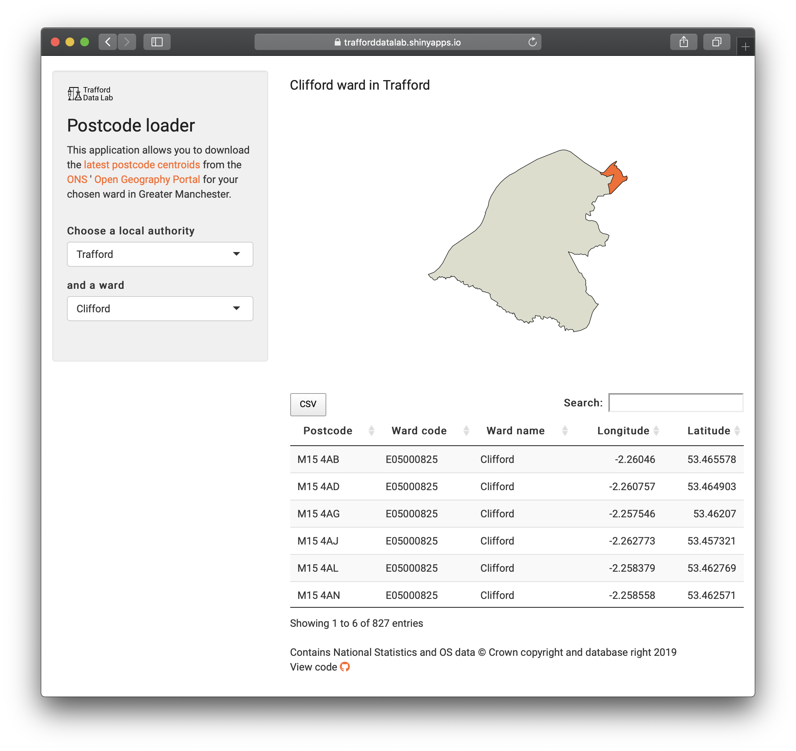

## Postcode loader
An <a href="https://cran.r-project.org/" target="_blank">R</a> <a href="https://cran.r-project.org/web/packages/shiny/index.html" target="_blank">Shiny</a> app allowing users to download the <a href="https://geoportal.statistics.gov.uk/datasets/ons-postcode-directory-latest-centroids" target="_blank">latest postcode centroids</a> from the <a href="https://www.ons.gov.uk/" target="_blank">Office for National Statistics</a>' <a href="https://geoportal.statistics.gov.uk/" target="_blank">Open Geography Portal</a> API.

The postcode centroids are available under the <a href="https://www.nationalarchives.gov.uk/doc/open-government-licence/version/3/" target="_blank">Open Government Licence 3.0</a> and the following attribution must be applied if using the data: 

>Contains National Statistics and OS data © Crown copyright and database right [YYYY]

<br>



<br />
The app can be viewed at <a href="https://trafforddatalab.shinyapps.io/postcode_loader/" target="_blank">https://trafforddatalab.shinyapps.io/postcode_loader/</a>

To run the app locally execute the following code:

``` r
shiny::runGitHub("trafforddatalab/postcode_loader")
```


